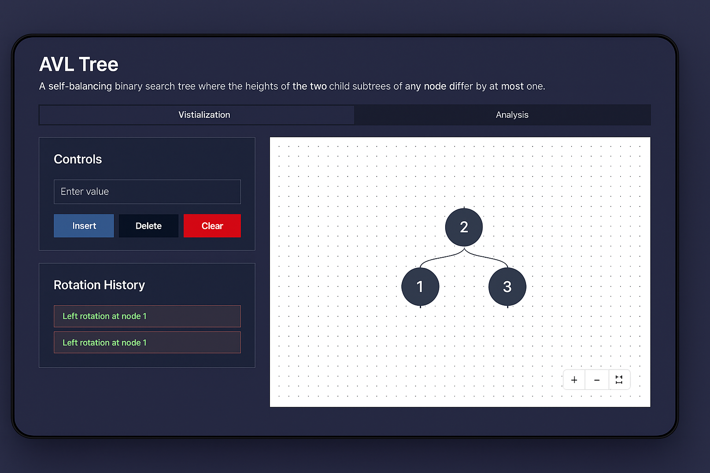

# AVL TREE Visualizer

An interactive tool for visualizing AVL Tree built with Next.js , TypeScript, Shadcn/ui, React Flow and Framer Motion.

### Data Structure
- **Trees**:  AVL with auto-balancing visualizations

## Tech Stack

- **Framework**: Next.js 15
- **Language**: TypeScript
- **Styling**: TailwindCSS
- **Animations**: Framer Motion
- **Graph Visualization**: React Flow
- **UI Components**: Shadcn/ui

